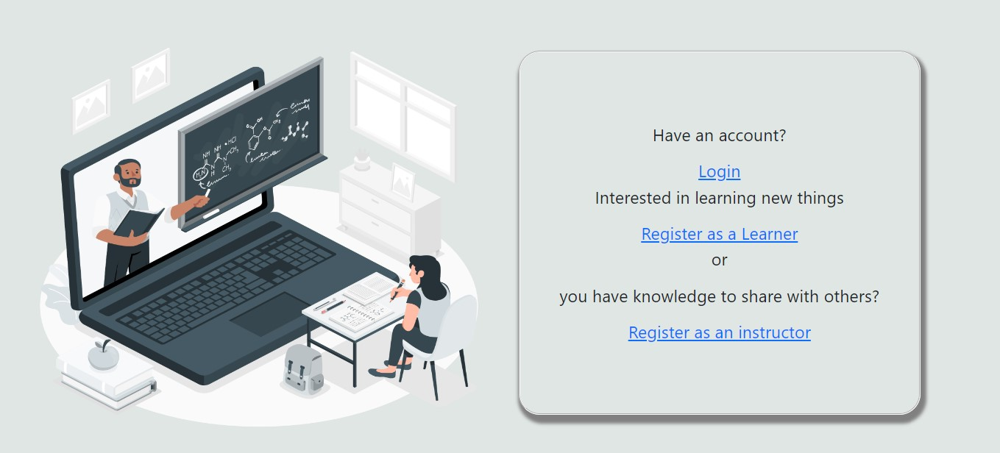
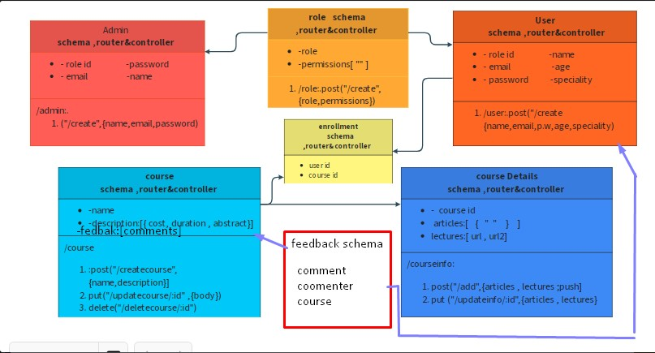

<p align="center">
<a href="https://www.meraki-academy.org" target="_blank" rel="noopener noreferrer">
 
 </a>
</p>

<h3 align="center">Easy Knowledge
</h3>

---

<p align="center"> Gaining knowledge easily as it never was! README 
    <br> 
<a href=''>Demo</a>
    <br> 
</p>

## 📝 Table of Contents

- [📝 Table of Contents](#-table-of-contents)
- [🧐 About ](#-about-)
- [🏁 Getting Started ](#-getting-started-)
  - [Prerequisites](#prerequisites)
  - [Installing:](#installing)
- [🎈 Usage ](#-usage-)
- [⛏️ Built Using ](#️-built-using-)
- [User Story ](#user-story-)
- [Data Flow ](#data-flow-)
- [⚠️ Guided By ](#️-guided-by-)
    - [Walaa Rababaa'](#walaa-rababaa)
    - [Anas Al-Khamis](#anas-al-khamis)
    - [Ahmad Sawalmeh](#ahmad-sawalmeh)
    - [©️ **MERAKI Academy**](#️-meraki-academy)

## 🧐 About <a name = "about"></a>

Easy knowledge gives you the short way to gain and share information.It's your platform where you can share your 
expertise and even learn more and more.It is  a fully responsive app with simple design for the best using experience from any device and any where !

## 🏁 Getting Started <a name = "getting_started"></a>

These instructions will get you a copy of the project up and running on your local machine for development and testing purposes.

### Prerequisites

- Visual Studio Code follow this <a href='https://code.visualstudio.com/download'>link</a> to install.
- Git Bash follow this <a href='https://git-scm.com/downloads'>link</a> to install.
- MongoDB follow this <a href='https://www.mongodb.com/try/download/community'>link</a> to install.
- Node.js follow this <a href='https://nodejs.org/en'>link</a> to install.


### Installing:

1. Clone the repo to your local machine using git bash.

```
git clone https://github.com/C8-HalaAbuShalbak/MERAKI_Academy_Project_4.git
```

2. Install packeges repeat this step in backend and frontend folder

```
npm i
```


1. Run server using git bash inside backend folder

```
npm run dev
```

4. Run application using git bash inside frontend folder

```
npm run start
```
or
```
npm start
```

Now  the app is ready to use!



## 🎈 Usage <a name="usage"></a>

Use this space to show useful examples of how a project can be used. Additional screenshots, code examples and demos work well in this space. You may also link to more resources.

Ex.

- You don't have to register to navigate our web app
- You can click on the **Home** tab provided in the navigation bar to view the home section
- You can click on the **Add to cart** button to add this product to your cart but you have to be one of our users, so you should create an account

## ⛏️ Built Using <a name = "built_using"></a>

- [MongoDB](https://www.mongodb.com/) - Database
- [Express JS](https://expressjs.com/) - Server Framework
- [React JS](https://https://reactjs.org/) - Web Framework
- [Node JS](https://nodejs.org/en/) - Server Environment

## User Story <a name = "#user_story"></a>


<a href='https://trello.com/b/AdQDg7b4/merakiacademyeasyknowledge'>Trello</a>

## Data Flow <a name = "#data_flow"></a>

</a>

## ⚠️ Guided By <a name = "guided_by"></a>

Thankful to the mentors :
#### Walaa Rababaa'
#### Anas Al-Khamis
#### Ahmad Sawalmeh
#### ©️ **[MERAKI Academy](https://www.meraki-academy.org)**